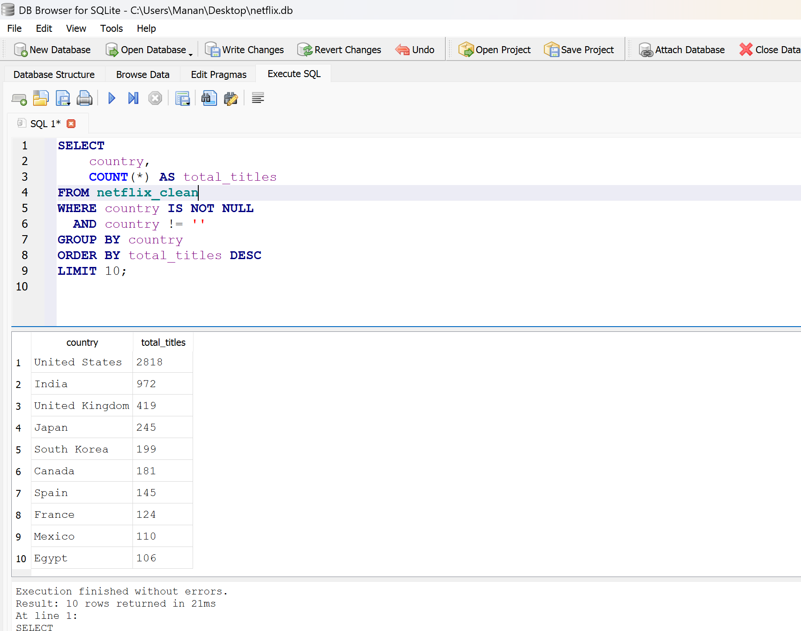
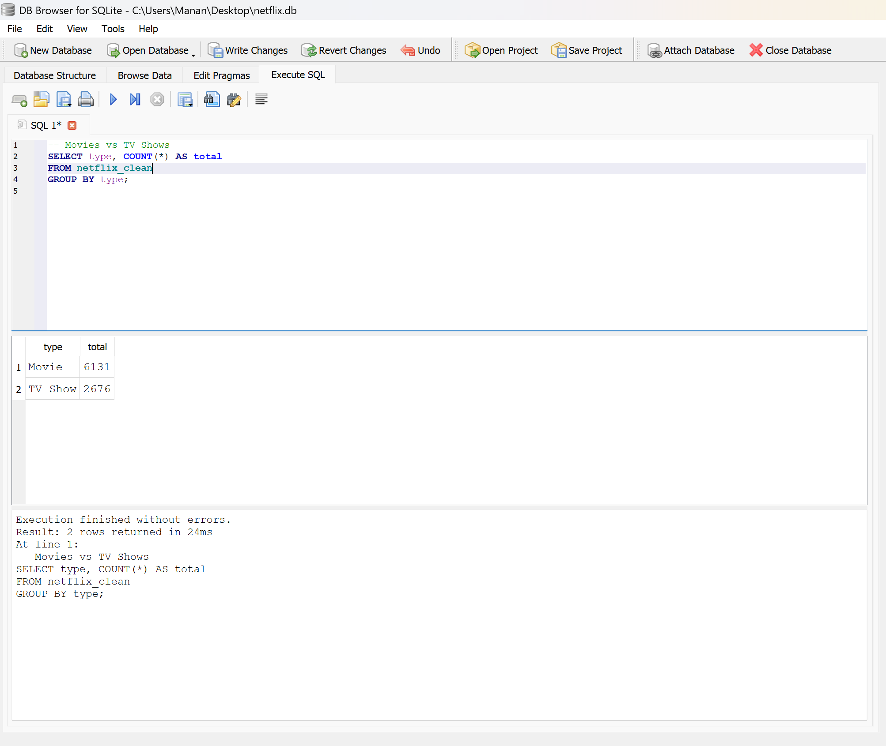
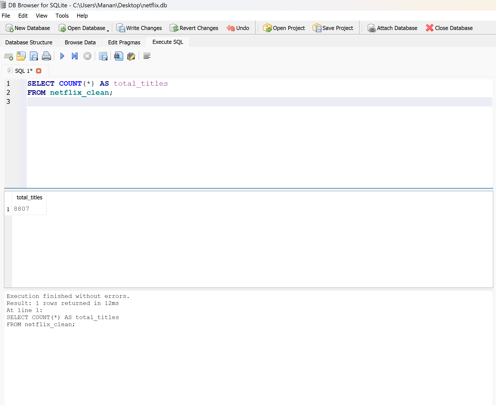

# Netflix SQL Data Analysis Project

## 📌 Project Overview
This project analyzes 8,800+ Netflix movies and TV shows to uncover trends in content strategy,
genre distribution, ratings, and country-wise availability.

## 📊 Dataset
- Source: Kaggle – Netflix Movies and TV Shows
- Records: ~8,800 titles
- Fields: Title, Type, Release Year, Rating, Genre, Country, Duration

## 🛠 Tools Used
- SQL (SQLite)
- DB Browser for SQLite

## 🔍 Key Analysis Performed
- Content growth over the years
- Genre popularity trends
- Country-wise content distribution
- Ratings evolution over time
- Movies vs TV shows comparison

## 📈 Key Insights
- Netflix content increased sharply after 2015
- Drama and International content dominate the catalog
- USA contributes the highest number of titles
- TV-MA is the most common rating
- Strong growth in non-English content

## 📂 Project Files
- `netflix.csv` – dataset
- `queries.sql` – SQL queries used for analysis
- `screenshots/` – output screenshots

 ## 📸 Sample Outputs

### Country-wise Content Distribution

### Movies vs TV Shows

### Total Titles

 

## 🚀 Live Demo
(Added below 👇)
# Netflix-sql-analysis
